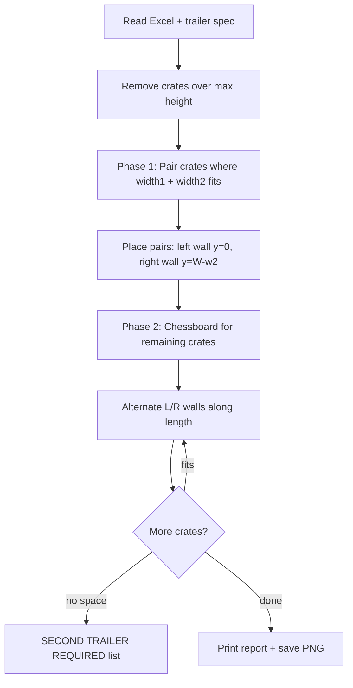

# Load Optimization

A Python tool for planning how heavy crates are loaded onto truck trailers. It produces a console report and a labelled floor-plan image so multiple people can see **which trailer** a layout belongs to and **what still needs a second trailer**.

Crates are **never rotated**. The planner enforces **left/right weight balance**, prefers **heavier weight toward the cab** (driver end), and respects **trailer dimensions and maximum weight**.

---

## What it does

1. Reads crate dimensions and weights from an Excel file (`crate_data.xlsx`).
2. Asks for trailer size (or uses the standard UK preset).
3. Places crates in two phases:
   - **Pairing** — two crates side-by-side when their combined width fits the trailer (left crate hugs the left wall, right crate hugs the right wall).
   - **Chessboard** — remaining crates that cannot be paired are placed one per row, alternating left wall / right wall along the trailer length.
4. Prints a load report and saves a PNG floor plan under `load_plans/`.
5. Lists any crates that do not fit with **`SECOND TRAILER REQUIRED`**.

Only crates that physically fit (space, height, weight limit, and balance rules) are loaded. Nothing is silently skipped.

---

## Loading rules (summary)

| Rule | Behaviour |
|------|-----------|
| Orientation | Fixed — length × width as stored; no turning crates |
| Pairing | If `width₁ + width₂ ≤ trailer width`, pair on left + right walls at the same row |
| Wide crates | Wider than half the trailer cannot pair; they use chessboard placement |
| Chessboard | Left wall (`y = 0`) and right wall (`y = trailer width − crate width`), alternating along length |
| Left/right balance | Loaded weight imbalance must stay within **10%** (configurable via `BALANCE_TOLERANCE` in code) |
| Cab weight | Heavier crates are preferentially placed toward the **cab end** when scoring positions |
| Height | Crates taller than the trailer are excluded and listed as skipped |
| Weight | Total loaded weight must not exceed the trailer maximum |

---

## Floor plan coordinates

Viewed from the **rear doors**, facing the **cab**:

```
  Doors (rear)                              Cab / driver
       x = 0  ──────────────────────────────────────►  x = length
       
       y = 0 (left wall)  ·····················  y = width (right wall)
```

- **x** — length along the trailer (loading end → cab).
- **y** — width across the trailer (left → right).

Wide crates on adjacent chessboard rows use **staggered x positions** (each row starts where the previous row ended) so they do not overlap in the middle of the trailer.

---

## Requirements

- Python 3.10+ recommended
- Dependencies in `requirements.txt`

### Install

```powershell
cd "d:\github\Load Optimization"
python -m venv .venv
.\.venv\Scripts\activate
pip install -r requirements.txt
```

For generating test data with `dummy_generator.py`, also install Faker:

```powershell
pip install faker
```

---

## Crate data (Excel)

Default file: **`crate_data.xlsx`** in the project folder (same folder as `Load_Optimization.py`).

### Required columns

| Column | Description |
|--------|-------------|
| `Asset Tag` | Unique crate identifier (string) |
| `Gross Weight (kg)` | Weight in kilograms |

### Dimensions (one of the following)

**Option A — separate columns (recommended for production)**

- `Length (cm)`
- `Width (cm)`
- `Height (cm)`

**Option B — single size string**

- `Size (cm)` in the form **`length x width x height`** (e.g. `147x131x257`)

Length runs along the trailer (door to cab). Width runs across the trailer. Height is vertical clearance.

### Optional columns

Other columns (e.g. `Crate ID`, `Crate Type`, `Location`) are ignored by the planner but can stay in the sheet for your own records.

---

## Running the planner

### Interactive (custom or UK trailer)

```powershell
python Load_Optimization.py
```

You will be prompted for:

1. **Trailer / load name** — e.g. `UK`, `INT`, `DUB`. Used in the report title and PNG filename so plots are identifiable.
2. **Use standard UK trailer? [Y/n]**
   - **Y** or **Enter** → UK preset (below).
   - **n** → enter your own length, width, height, and max weight. UK values appear in brackets as defaults; press Enter to keep a default or type a new value.

### Quick UK test (no prompts)

```powershell
python Load_Optimization.py --uk --name UK-TEST
```

| Flag | Purpose |
|------|---------|
| `--uk` | Use standard UK dimensions without asking |
| `--name UK-TEST` | Trailer label on the plot and in the filename |

### Standard UK trailer (testing)

| Dimension | Value |
|-----------|--------|
| Length | 1360 cm (door to cab) |
| Width | 240 cm |
| Height | 270 cm |
| Max weight | 26,000 kg |

---

## Output

### Console report

- Trailer name and dimensions
- Crates skipped (too tall)
- Count loaded vs total
- Asset tags loaded
- Total weight, left/right split, imbalance %
- Weight toward cab vs doors
- **`SECOND TRAILER REQUIRED`** — asset tags that need a follow-up load

### Floor plan image

Saved to:

```
load_plans/load_plan_<trailer-name>_<timestamp>.png
```

The image includes:

- Trailer outline and each crate (with shortened asset tag)
- **Cab / driver** and **Doors (rear)** labels
- Title with trailer name and dimensions
- Summary box (crate count, weights, cab/door split)

Share the PNG file so others can see which trailer the layout refers to without re-running the script.

---

## Generating test data

```powershell
python dummy_generator.py
```

Creates or overwrites `crate_data.xlsx` with 25 random crates (fixed seed for repeatability). Adjust `crate_sizes` and weight ranges in the script for different test scenarios.

Example scenarios you can model by editing the generator or Excel file:

- **Mixed widths** — some crates pair side-by-side, others use chessboard.
- **All wide** — every crate wider than half the trailer; only chessboard rows (no pairing).

---

## Project structure

```
Load Optimization/
├── Load_Optimization.py   # Main planner
├── dummy_generator.py     # Optional test Excel generator
├── crate_data.xlsx        # Input data (your real or test crates)
├── requirements.txt       # Python dependencies
├── load_plans/             # Output PNG floor plans (created on run)
└── README.md
```

---

## How the algorithm works



**Phase 1 — Pairing**  
Among remaining crates, the planner searches for the best pair that fits side-by-side, respects the weight limit, and keeps left/right balance within tolerance. Pairs are placed with the heavier-combined row preferentially toward the cab when possible.

**Phase 2 — Chessboard**  
Each remaining crate is placed on **only** the left or right wall. Rows advance along **x** so wide crates do not overlap. The planner alternates sides row-by-row and allows brief imbalance mid-sequence when the next row restores balance (typical for similar-weight wide crates).

---

## Custom trailer sizes

You are not limited to the UK preset.

- Run `python Load_Optimization.py` and answer **n** at the UK prompt, then enter length, width, height, and max weight; or
- Use the UK values as defaults and change only what you need (e.g. longer INT length, different weight limit).

The same pairing and chessboard logic applies to any dimensions you enter.

---

## Limitations and expectations

- **Greedy planner** — good operational layouts, not a guarantee of mathematically optimal packing.
- **1 cm grid** — dimensions are rounded up to whole centimetres for placement.
- **Single trailer per run** — overflow crates are reported for a **second trailer**; run the tool again with only those crates if you want a separate plan.
- **Runtime** — depends on crate count and trailer size (roughly tens of seconds for ~25 crates on a fine grid).
- **Balance tolerance** — default 10%; change `BALANCE_TOLERANCE` at the top of `Load_Optimization.py` if your site rules differ.

---

## Troubleshooting

| Issue | What to check |
|-------|----------------|
| `ModuleNotFoundError: openpyxl` | Run `pip install -r requirements.txt` |
| `ModuleNotFoundError: faker` | Run `pip install faker` before `dummy_generator.py` |
| Many crates in overflow | Trailer may be full; verify dimensions and weights in Excel |
| All crates skipped | Heights in Excel may exceed trailer height |
| Wrong layout shape | Confirm `Size (cm)` order is **length x width x height** |
| Plot not found | Look in `load_plans/` under the project folder |

---

## Running on a work PC (no VS Code, no console)

For warehouse or office PCs without developer tools, use the **desktop app**:

1. Double-click **`Run Load Planner.bat`** — opens a normal Windows window.
2. Or ask IT to build **`Load Planner.exe`** once with `build_exe.bat` and copy it to PCs that do not have Python.

Full deployment steps (IT checklist, shortcuts, troubleshooting): **[DEPLOY_WORK_PC.md](DEPLOY_WORK_PC.md)**

---

## Example commands

```powershell
# Full interactive run with custom trailer
python Load_Optimization.py

# Standard UK trailer, named plot
python Load_Optimization.py --uk --name UK-01

# Regenerate test Excel, then plan
python dummy_generator.py
python Load_Optimization.py --uk --name UK-WIDE
```

---